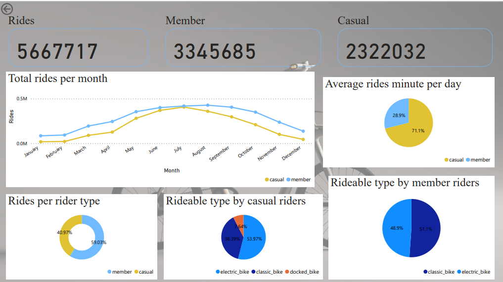

# Cyclistic_Analysis

## Introduction
In 2016, Cyclistic launched a successful bike-share offering. Since then, the program has grown to a fleet of 5,824 bicycles that are geo-tracked and locked into a network of 692 stations across Chicago. The bikes can be unlocked from one station and returned to any other station in the system anytime. 
One approach that helped Cyclistic marketing team in building general awareness was by creating flexibility of pricing plans: Single-ride passes, full-day passes and annual membership. Customers who purchase single-ride or full-day passes are referred to as casual riders while customers who purchase annual memberships are Cyclistic members.

**_Disclaimer_**: This is my google data analytics programme project.

## Problem statement
How do annual members and casual riders use Cyclistic bikes differently?

## Skills/Tools used:
- Excel
- SQL
- Power BI

## Dataset
The dataset was downloaded from [here](https://divvy-tripdata.s3.amazonaws.com/index.html). I downloaded the 2022(Jan-Dec) year dataset. The data has been made available by Motivate International Inc.

## Cleaning Steps
1. Downloaded the Cyclistic trip data.
2. Created a folder on my desktop and moved my files there.
3. Opened my spreadsheet and created a column which i subtracted column "ended_at" from column "started_at" and named it column "ride_length" using HH:MM:SS as the format.
4. Created a column and called it "day_of_week" and calculated it by using the WEEKDAY command on excel

## Analysis
**Step 1** -**Importing Dataset** 

This was a bit of challenge for as i kept getting error messages but i was able to figure it out. I have now understood how to import flat files to SQL

**Step 2** -**Joining Tables**

```
Select * into cyclistic_table from January
Union all
Select * from February
Union all
Select * from March
Union all
Select ride_id, rideable_type, day_of_week, started_at, ended_at, ride_length, start_station_name, cast(start_station_id as nvarchar), 
end_station_name, end_station_id, start_lat, start_lng, end_lat, end_lng, member_casual from April
Union all
Select * from May
Union all
Select * from June
Union all
Select ride_id, rideable_type, day_of_week, started_at, ended_at, ride_length, start_station_name, cast(start_station_id as nvarchar), 
end_station_name, end_station_id, start_lat, start_lng, end_lat, end_lng, member_casual from July
Union all
Select * from August
Union all
Select ride_id, rideable_type, day_of_week, started_at, ended_at, ride_length, start_station_name, start_station_id, 
end_station_name, cast(end_station_id as nvarchar), start_lat, start_lng, end_lat, end_lng, member_casual from September
Union all
Select ride_id, rideable_type, day_of_week, started_at, ended_at, ride_length, start_station_name, cast(start_station_id as nvarchar), 
end_station_name, end_station_id, start_lat, start_lng, end_lat, end_lng, member_casual from October
Union all
Select ride_id, rideable_type, day_of_week, started_at, ended_at, ride_length, start_station_name, cast(start_station_id as nvarchar), 
end_station_name, cast(end_station_id as nvarchar), start_lat, start_lng, end_lat, end_lng, member_casual from November
Union all
Select ride_id, rideable_type, day_of_week, started_at, ended_at, ride_length, start_station_name, start_station_id, 
end_station_name, cast(end_station_id as nvarchar), start_lat, start_lng, end_lat, end_lng, member_casual from December
```

I ran the above code to join the tables January-December.
As you can see from the code above, I had to write out the columns for April, July, September, October, November, and December because, in contrast to the others, their "started_at" and "ended_at" columns are of the float data type rather than the Nvarchar data type. This change was necessary to allow for joining.

**Step 3** -**Calculating Ride Statistics**

Firstly i calulated the Total number of rides taken for the year 2022 using the COUNT Function and then I calculated the Total Rides and Average ride of each rider type ie "member" and "casual" Using WHEN, COUNT, DATEDIFF and GROUPBY Functions with this code chunks:

```
SELECT COUNT(ride_id) AS total_ride 
   FROM cyclistic_table

SELECT
    CASE
        WHEN member_casual = 'member' THEN 'Member'
        WHEN member_casual = 'casual' THEN 'Casual'
        ELSE 'Other'
    END AS rider_type,
    COUNT(ride_id) AS total_rides,
    AVG(DATEDIFF(MINUTE, started_at, ended_at)) AS avg_ride_duration
FROM
    cyclistic_table
Group by
member_casual
```

I also calculated the Total number of time taken(minutes) by each Rider type using DATEDIFF and GROUPBY functions:
```
SELECT member_casual, 
   SUM(DATEDIFF(MINUTE, started_at, ended_at)) As Total_minutes
   FROM cyclistic_table
   GROUP BY member_casual
```

**Step 4** -**Analyze usage patterns**

To establish which weekdays had more or fewer rides, I created smaller tables that displayed the number of rides taken by Members and Casual Riders.
```
SELECT DATENAME(WEEKDAY,started_at) AS week_day,
   COUNT(*) AS ride_count
   FROM
   cyclistic_table
   WHERE
   member_casual = 'casual'
   GROUP BY
   DATENAME(WEEKDAY,started_at)
   ORDER BY
    Case
	When DATENAME(WEEKDAY,started_at) = 'Sunday' Then 1
	When DATENAME(WEEKDAY,started_at) = 'Monday'Then 2
	When DATENAME(WEEKDAY,started_at) = 'Tuesday'Then 3
	When DATENAME(WEEKDAY,started_at) = 'Wednesday'Then 4
	When DATENAME(WEEKDAY,started_at) = 'Thursday'Then 5
	When DATENAME(WEEKDAY,started_at) = 'Friday'Then 6
	When DATENAME(WEEKDAY,started_at) = 'Saturday'Then 7
	END
    
   SELECT DATENAME(WEEKDAY,started_at) AS week_day,
   COUNT(*) AS ride_count
   FROM
   cyclistic_table
   WHERE
   member_casual = 'member'
   GROUP BY
   DATENAME(WEEKDAY,started_at)
   ORDER BY
    Case
	When DATENAME(WEEKDAY,started_at) = 'Sunday' Then 1
	When DATENAME(WEEKDAY,started_at) = 'Monday'Then 2
	When DATENAME(WEEKDAY,started_at) = 'Tuesday'Then 3
	When DATENAME(WEEKDAY,started_at) = 'Wednesday'Then 4
	When DATENAME(WEEKDAY,started_at) = 'Thursday'Then 5
	When DATENAME(WEEKDAY,started_at) = 'Friday'Then 6
	When DATENAME(WEEKDAY,started_at) = 'Saturday'Then 7
	END
```
I aslo Analyzed usage patterns by looking at the purpolar Stations for each rider type. This was acheived with this code chunks:

```
SELECT
    start_station_name, 
    COUNT(*) AS ride_count
FROM
    cyclistic_table
WHERE
    member_casual = 'Casual'
GROUP BY
    start_station_name, end_station_name
ORDER BY
    ride_count DESC
    
    SELECT
    start_station_name,
    COUNT(*) AS ride_count
FROM
   cyclistic_table
WHERE
    member_casual = 'member'
GROUP BY
    start_station_name
ORDER BY
    ride_count DESC
 ```

## Visualization


The above image shows:

1. The cumulative number of rides recorded on the initial card.
2. The aggregate count of rides attributed to Member riders on the second card.
3. The combined tally of rides associated with Casual riders on the third card.
4. The bar chart illustrates the monthly total rides for each rider category. Member riders consistently outpace casual riders in ride frequency. Notably, Casual riders registered their highest ride count in July, while Member riders achieved their peak in August.This discrepancy can be attributed to the fact that Members likely use the service more regularly, possibly for their daily commute, while Casual riders may use it more sporadically for leisure or occasional transportation needs
5. The Pie chart depicts the percentage of average ride duration for each rider category. Casual riders allocate more time to their rides compared to annual members.
6. The donut chart exhibits the percentage distribution of rides by rider type. Member riders engage in more rides than Casual riders.
7. The last two pie charts display the choice of rideable types utilized by both Member and Casual riders. Casual riders opt for all three bike types (Electric bikes, classic bikes, and docked bikes), whereas Member riders abstain from using docked bikes.This could be due to differences in convenience, availability, or preference among the two rider categories. For example, Members might find Electric and Classic bikes more convenient for their regular routes, while Casual riders might explore various options, including Docked bikes, for more flexible rides.

## Conclusion
Based on the data, it's clear that Member riders are more active and engaged, taking more rides and having higher ride durations on average. However, Casual riders also show a strong presence, especially in certain months, indicating a potential market segment for targeted promotions or services.

## Recommendation
1. Promote Docked Bikes to Members: Encourage Member riders to try docked bikes through special promotions or discounts to diversify their ride experiences.
2. Member Engagement: Continue to engage Member riders with loyalty programs, exclusive offers, or events to maintain their higher ride frequency.
3. Encourage casual riders to become members by setting rewards systems in place for casual riders. This can help more casual riders sign up for Cyclistics membership.
4. Evaluate the Impact of Marketing Campaigns: Analyze the effectiveness of marketing campaigns or promotions launched during August to determine what drove the surge in Member ridership during that month. Use these insights to plan future campaigns.
